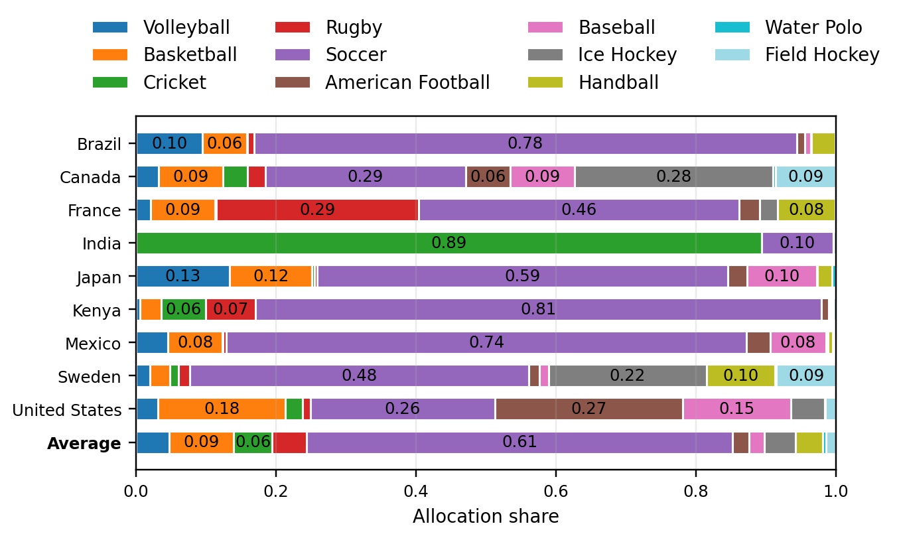
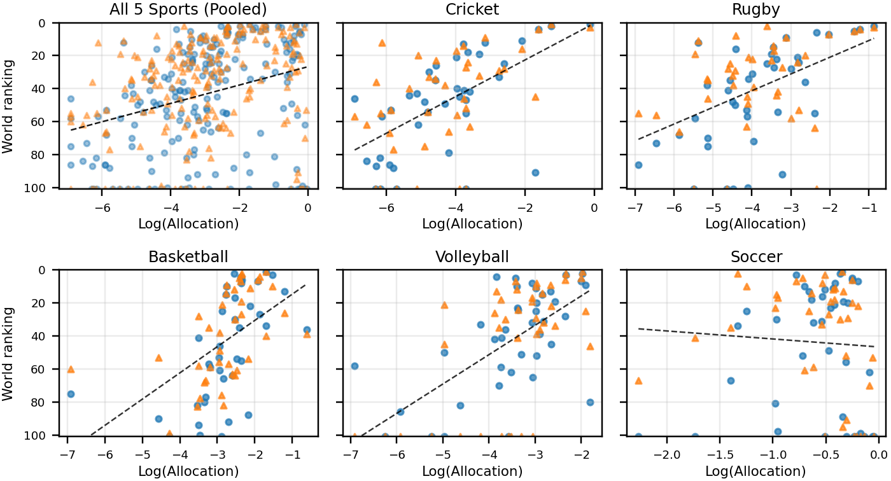
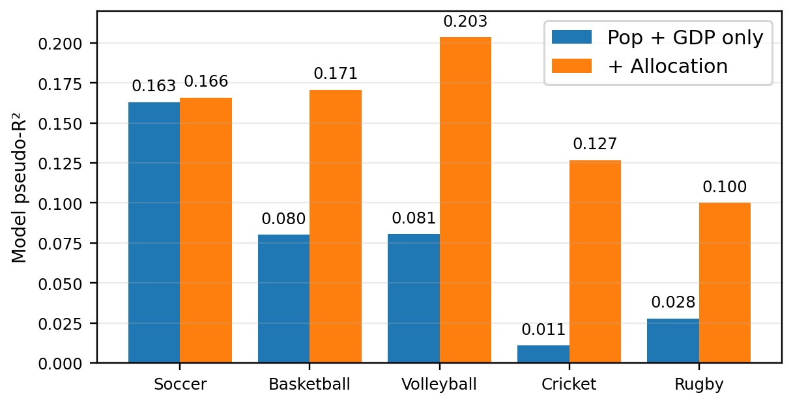

As an American in the U.K., I spend a non-trivial amount of time rationalizing our persistent futility in men’s soccer. (The word “soccer” was [invented in Oxford](https://www.britannica.com/story/why-do-some-people-call-football-soccer), and I will not be discussing this point any further.) My usual defense is a simple and familiar one: the U.S. has an enormous wealth of elite athletic talent, but we spend it all on things that the rest of the world doesn’t really care about, like the NFL, NBA, MLB, and NHL. 

This isn’t an insult to Christian Pulisic and Weston McKennie. If anything, they deserve extra credit for surviving our coordinated national effort to lure them into literally any other sport. The career math just isn’t very inviting when the [highest-paid American in the MLS](https://mlsplayers.org/resources/salary-guide) (Walker Zimmerman, at \$3.5 million) makes less than the [median starting NFL kicker](https://overthecap.com/position/kicker) (\$4 million, by my count). Compare that to Argentina and France, where any three-year-old who can run fast is immediately enlisted in an academy, and it’s no wonder we can’t compete.

What about our world-class women’s team? As I see it, their success only confirms the theory. Suppose you have an athletically precocious daughter in Ohio. Sure, she might play basketball or volleyball, but if she wants a career in professional sports, her destination is much more likely to be soccer. We point our best female athletes at the game, and – surprise – we win trophies. 

It’s a clean, intuitive, and satisfying theory that turns our soccer failures into a byproduct of our sporting success elsewhere. So what does the data say?

### The data

Let’s start with what we’re trying to predict. For the five most widely played international team sports – [soccer](https://www.eloratings.net/), [basketball](https://www.fiba.basketball/en/ranking/women), [rugby union](https://www.world.rugby/rankings), [cricket](https://www.icc-cricket.com/rankings/team-rankings/womens/t20i), and [volleyball](https://en.volleyballworld.com/volleyball/world-ranking/men) – I pulled the February 2026 world rankings, for both women and men. We end up with a set of 40 countries, reasonably well-spread across the globe, that show up in at least eight of the ten rankings. For example, Greece has a men’s and women’s team for every sport on the list, except women’s rugby union. (They apparently have a women’s “rugby league” team, but the cultural implications of that nuance are beyond the scope of this writer.)

I’m ignoring individual sports for now, to keep the comparisons clean. The implicit assumption is that they draw from entirely different talent pools; in other words, that world-class golfers, sprinters, and figure skaters were never going to play in the World Cup regardless, and vice versa. This is a particularly large asterisk for China, with its famous program of steering athletic kids into focused Olympic niches, but we’ll cross our fingers and hope the noise isn’t too loud. 

Our argument is that within any given country, elite team sports compete for sparse national talent. If we assume that “potential to be a world-class athlete” is evenly distributed across the globe, then your country’s starting point is just a function of your population. The next question is how well you spot and foster that potential, turning talented kids into skilled professionals. We’ll proxy this development capacity with GDP per capita, as a rough catch-all for “sporting infrastructure”. The [population](https://en.wikipedia.org/wiki/List_of_countries_and_dependencies_by_population) and [GDP](https://en.wikipedia.org/wiki/List_of_countries_by_GDP_(PPP)_per_capita) data both come from Wikipedia.

With a pool of developed top-flight athletes in place, the next question is how they are allocated across sports. Our measure of national attention comes from [Google Trends](https://trends.google.com/trends/), a tool that tracks the relative popularity of search terms across different time periods and regions. Its accessibility is precisely why it has launched a thousand lazy social science papers, but for our purposes, it is surprisingly well-suited. It allows us to sidestep the manual labor of collecting data about government spending or stadium attendance, and jump straight to where a nation's eyes are collectively focused. 

To predict world performance in 2026, we use Trends data from 2006 to 2015. The ten-year lag reflects the time needed to develop players, and avoids the boondoggle of reverse causality: you hear the U.S. cricket team just pulled off a [big upset](https://www.espncricinfo.com/series/icc-men-s-t20-world-cup-2025-26-1502138/pakistan-vs-united-states-of-america-12th-match-group-a-1512730/full-scorecard), so you look up what a “wicket” is (and become even more confused), but that search doesn’t help the players who are already on the pitch. 

For each of our 40 countries, we get a breakdown that sums to 100%, showing the allocation of national interest to our five key sports – soccer, basketball, rugby, cricket, and volleyball – along with six others that are broadly popular enough to siphon athletes away – field hockey, ice hockey, handball, baseball, American football, and water polo. (To see how we get from raw Trends data to a clean numerical breakdown, see the appendix.)

A few examples are plotted below. The average country spends 61% of its attention budget on soccer, a huge monopoly compared to the next-most-popular sport, which is basketball at 9%. India's single-minded obsession with cricket stands out, as do other specific sports in places you'd expect -- ice hockey for Canada and Sweden, rugby for France, baseball for Japan. 

Interestingly, the U.S. isn't nearly as dominated by American football as expected. Between the generally fractured landscape and the broad popularity of soccer as a youth sport, American football only commands 27% of the attention, with soccer close behind at 26%. Basketball at 18% and baseball at 15% round out a uniquely competitive internal market.

### The model

Now on to building the regression. World ranking points in different sports are arbitrarily noisy, but we can’t just fit a standard linear model to the rankings themselves, because they’re capped by first place. If increasing your national attention to a sport by 10% linearly improves your rank by 10 places, then soon we’ll have no choice but to conclude that Brazil should perenially be ranked negative 5th in soccer. 

What we need is a custom-defined [generalized linear model (GLM)](https://en.wikipedia.org/wiki/Generalized_linear_model), which bends the straight line into an appropriate S-curve. This enforces a cap on the predictions, and reflects the reality of diminishing returns: as you approach the top of the table, it gets exponentially harder to gain that last fraction of a point. In particular, we’ll use a [fractional logit model](https://en.wikipedia.org/wiki/Fractional_model) to map world rankings onto a scale from 0 to 1, where first place gets 1.00, second place is 0.99, and so on, down to 0.01 for 100th place. Anything below that, including if the country has no team at all, gets a 0. (Full details on the model are in the appendix.) 

This forces a fixed spacing between the entries, but I argue that’s actually a feature, not a bug. World rankings are the relevant target because of how fans communicate. When people talk about their national team, they say “we’re 5 spots higher than you”, not “we exceed you by 27.34 weighted average points according to the [proprietary FIFA Coca-Cola © methodology](https://inside.fifa.com/fifa-world-ranking/procedure-men).”

We first fit the rankings to population and GDP per capita, then add the sport-specific attention coefficients. I’ve logged all the covariates, to keep outliers from breaking the scale, and centered the attention values around the mean for each sport, to focus on which countries are over-indexing their interest. 

The results are below: the model with just population and GDP has a [pseudo R-squared](https://en.wikipedia.org/wiki/Pseudo-R-squared) of 5.43%, and adding attention boosts that to 12.68%. On the one hand, we’ve more than doubled the explained variance, a substantial improvement that suggests "interest" really is a primary driver. On the other hand, we’re still only accounting for about one-eighth of what makes a team good.

<table style="width: 100%; margin: 0 auto;">
	<colgroup>
		<col style="width: 30%;">
		<col style="width: 20%;">
		<col style="width: 20%;">
		<col style="width: 15%;">
		<col style="width: 15%;">
	</colgroup>
	<thead>
		<tr>
			<th>Covariate</th>
			<th>Coefficient</th>
			<th>Std. error</th>
			<th>Z-score</th>
			<th>p-value</th>
		</tr>
	</thead>
	<tbody>
		<tr><td colspan="5"><strong>Model 1: Population + GDP per capita | Pseudo-R²: 0.0543</strong></td></tr>
		<tr><td>Intercept</td><td>-10.501</td><td>2.397</td><td>-4.382</td><td>&lt;0.001</td></tr>
		<tr><td>Population</td><td>0.251</td><td>0.076</td><td>3.296</td><td>&lt;0.001</td></tr>
		<tr><td>GDP per capita</td><td>0.614</td><td>0.139</td><td>4.412</td><td>&lt;0.001</td></tr>
		<tr><td colspan="5"><strong>Model 2: Model 1 + Allocation | Pseudo-R²: 0.1268</strong></td></tr>
		<tr><td>Intercept</td><td>-10.412</td><td>2.513</td><td>-4.143</td><td>&lt;0.001</td></tr>
		<tr><td>Population</td><td>0.301</td><td>0.083</td><td>3.641</td><td>&lt;0.001</td></tr>
		<tr><td>GDP per capita</td><td>0.526</td><td>0.144</td><td>3.658</td><td>&lt;0.001</td></tr>
		<tr><td>Attention</td><td>0.447</td><td>0.091</td><td>4.903</td><td>&lt;0.001</td></tr>
	</tbody>
</table>

To diagnose this, let’s step back down into sport-specific results. These five plots show world ranking vs. attention for each sport individually, with men’s teams in blue and women’s teams in orange. Soccer immediately jumps out as the one with no clear trend. 

When we fit individual models for each sport, first with population and GDP only, then with attention added, we see a huge jump in R-squared for every sport, except soccer. 

We end up with three distinct stories.

* Cricket and rugby: Niche sports where attention is the primary driver of success, and including it improves the model by an order of magnitude. These are cultural obsessions in specific corners of the world, so population and wealth alone tell you very little.

* Basketball and volleyball: Global average sports where attention is roughly half the story, in line with the pooled model. They are popular enough that scale matters, but they haven’t hit a ceiling yet. They sit at a “sweet spot” where more national attention translates directly into a better team.

* Soccer: The outlier, where attention has almost zero predictive power.

### What does it all mean? 

My interpretation? International soccer is the only sport that has reached a long-term equilibrium. Recall that our allocation data doesn’t reflect investment, facilities, or coaching, only Google search interest. In younger or more niche sports, that interest is a leading indicator, because there is still room in the talent pool. If a country starts looking up rugby or basketball today, it signals a shift in the national sporting culture that could map to trophies in a decade. But in soccer, everyone is already trying. When the global depth is so immense, you can’t just "interest" your way to a better world ranking -- you need the grassroots facilities, generational coaching networks, and deep-rooted culture to back it up. 

In this sense, the increase in R-squared for each sport above serves as an (inverted) "Global Competitiveness Index": rugby and cricket would be more open to disruption by a nation that suddenly decided to care, whereas soccer has no easy wins left for anyone. This is exacerbated by the sport's unique competitive density. Consider a matchup between the 40th-ranked and 5th-ranked men's teams: in soccer (Algeria vs. Colombia), it could genuinely go either way, but in cricket (Denmark vs. South Africa), most oddsmakers wouldn't even offer a bet. There's a structural ceiling in soccer, where a country's current attention matters far less than its historical head start. 

Empirical evidence for this is difficult to pin down (which is precisely why I didn't try to) but there are some promising prior indications. Sports statistics fans of a certain age will recall the 2009 book "Soccernomics", in which Simon Kuper and Stefan Szymanski modelled goal differences across several decades of top-flight men's international matches. They found that "experience" -- defined as the number of prior matches played by a country -- was several times more important than either population or GDP, boosting the overall R-squared up to 26%. It is a slightly circular argument (you get better at soccer by playing a lot of soccer), but it supports the idea that in a saturated market, you don't just need talent and interest; you need the institutional memory that only comes from decades of being in the room.

What does this mean for my beloved U.S. men’s team? Unfortunately, it suggests that the allocation defense is a bit of a trap. Even if we diverted every top athlete in the country to soccer tomorrow, we’d still be running head-first into a century-old wall of global infrastructure. I suspect we’ll win the World Cup right around the same time Texas turns blue. Attention isn’t enough – what we really need is patience, time, and a healthy dose of luck.

And what about the U.S. women’s team? They didn’t succeed just because American girls "cared more" about soccer; they succeeded because, for thirty years, Title IX gave the U.S. the world's best development pipeline. Now that Europe has reached equilibrium, applying their existing academies and footballing intelligence to the women’s game, our head start has evaporated. Interest was our leading indicator, but the global resource wall has caught up.

I promised you an early prediction of the 2038 World Cup (a 96-team tournament that will be hosted at a yet-to-be-built floating city just off the coast of Dubai). I pulled the Google Trends data for 2016 to 2025, and I was going to use it to inform my predictions. But now that I’ve seen these results? My early favorites for 2038 are Argentina, Brazil, Spain, and France.

### Appendix

I'm always happy to discuss collaboration ideas, or share code and data; my contact information is available under the CV tab.

First, we'll cover how the Google Trends data for each country was converted to an allocation vector. Credit goes to the deep minds at Google for the “Topics” mechanism within the tool, which saves us from the rabbit hole of determining which specific search terms to include. We don’t have to decide between “Champions League” and “Super Bowl” or (god forbid) “FIFA” and “NFL” as our lookup keys. They have handed us “soccer”, “American football”, etc. as pre-defined groupings that we can neatly put in our shopping basket. 

Google rescales every query pull to a 0–100 index, so values from different searches aren't directly comparable. Furthermore, soccer’s massive popularity often "breaks" the scale, flattening the variance of smaller sports. To solve this, I used an anchor set of four sports (volleyball, basketball, cricket, and rugby union) as a common denominator across three separate data pulls:

* Group 1: Anchor set plus soccer

* Group 2: Anchor set plus baseball, ice hockey, and handball

* Group 3: Anchor set plus American football, water polo, and field hockey

For each country, I calculated the mean topic interest for every sport within each group. To normalize these across the three pulls, I rescaled each sport relative to that file's anchor mean (the average of the four anchors). I then averaged these rescaled values across the three files and kept the 11 team-sport topics used in the article. Finally, I normalized the shares so that they sum to 1. This gives each country a clean allocation vector representing the share of national interest dedicated to each sport.

Second, a quick note on the fractional logit GLM. Recall that we convert world ranking into a 0-1 performance score (from rank 100+ to rank 1, respectively). The model then uses a standard logit link function to map our linear predictors to the performance scores:

$$\text{logit}(\mu_i) = \ln(\mu_i/(1 - \mu_i)) = X_i \beta$$

In this setup, the logit link stretches the bounded 0–1 performance scores onto an infinite scale. This setup allows the model to handle the asymptotic nature of elite performance, where the leap from #2 to #1 requires significantly more input than a move in the middle of the pack.
