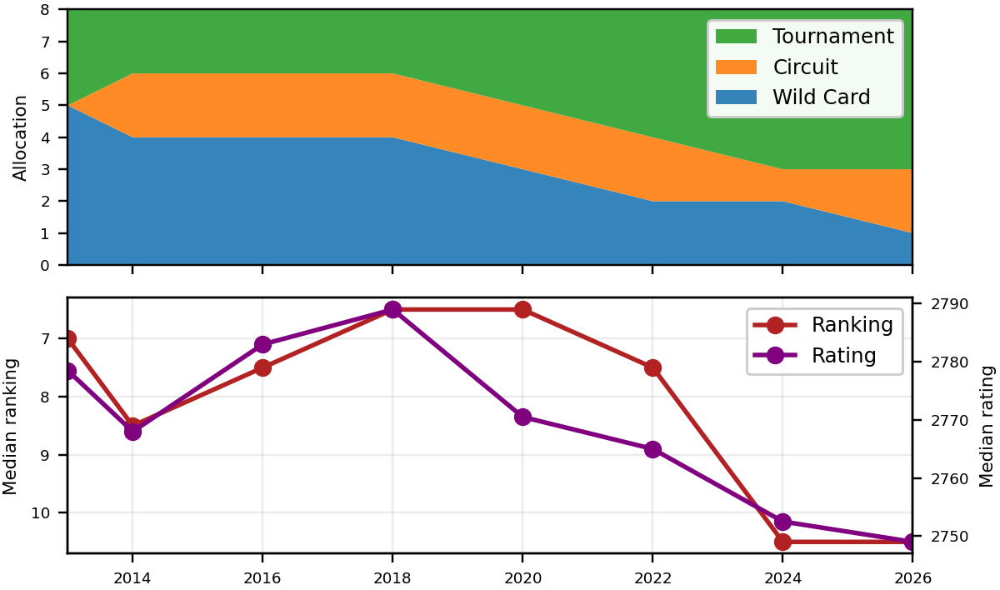
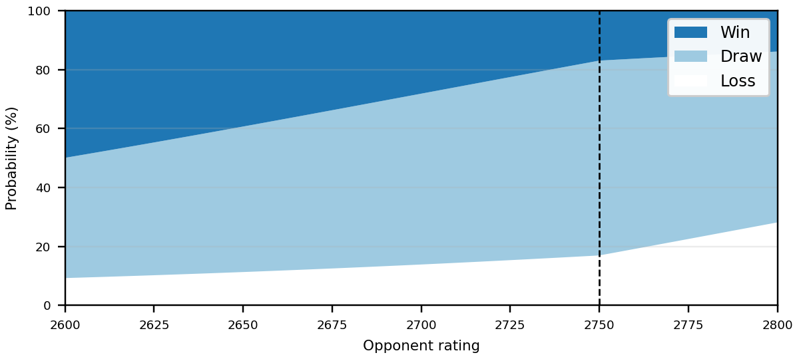
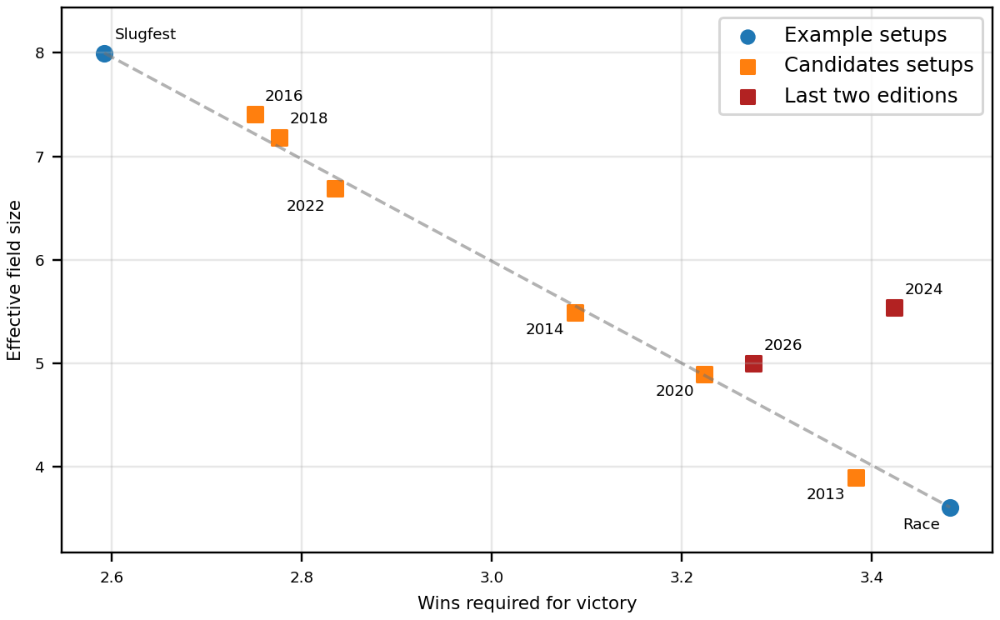
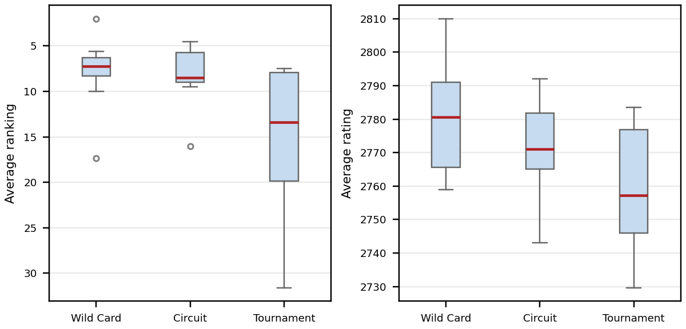

Classical chess is a marketing nightmare. There’s an old quote: “Football is a simple game; 22 men chase a ball for 90 minutes and at the end, the Germans win.” The chess version is even bleaker: “2 people sit in chairs for 5 hours and at the end, it’s a draw.” Thanks to hyper-precise computer preparation, chess openings have been essentially solved; world-class grandmasters recite twenty moves of optimized theory, then spend the rest of the afternoon hoping their opponent makes the slightest error, only to reach a standstill roughly two-thirds of the time.

To make things worse, the sport’s competitive structure is a total bottleneck. The World Championship is organized by FIDE, a governing body so [cartoonishly](https://www.theguardian.com/sport/2016/jun/03/chess-fide-president-offshore-firms-rights-kirsan-ilyumzhinov) [corrupt](https://www.chess.com/news/view/the-fide-elections-and-the-fight-against-corruption) it could probably teach FIFA a [few](https://www.bbc.co.uk/news/articles/cx2894q91ngo) [tricks](https://www.politico.eu/article/how-vladimir-putin-uses-chess-arkady-dvorkovich/). For reasons rooted more in Victorian tradition than modern streaming, chess has modelled itself after heavyweight boxing: there is a single reigning champion who sits on the throne for two years, until they are forced to defend themselves in a grueling, 14-game head-to-head match against a challenger. 

Who gets to battle the final boss? The last one standing in the eight-player, double-round-robin Candidates Tournament. Even by the usual standards of high-stakes sports, this is a dramatically career-defining event. After three weeks of intense play, often coming down to the final day, the winner secures a permanent seat in the history books and a guaranteed $1 million payday just for showing up to the title match. The runner-up gets $50,000 and a pat on the back. You’re the second-best player in the world, but you slipped up in Round 14? Tough – try again next time, assuming you even qualify again.

It probably slipped under your radar, but the [2026 Candidates Tournament](https://en.wikipedia.org/wiki/Candidates_Tournament_2026) in Cyprus just wrapped up. Given the pressure, and the draw-prone conservatism of top-level chess, you might have expected it to devolve into a starting contest: everyone scared to attack, just trying to avoid blunders and live another day. But unintentionally, through no competence of their own, FIDE has managed to make it one of the most thrilling events in the sport. How? By injecting chaos into the qualification process.

### The competition

(If you’re one of my two readers who follows top-level competitive chess, feel free to plow straight ahead. For everyone else, I’ve tucked some helpful context in the appendix. Or just keep reading and fill in the blanks with the silliest backstory you like – it probably won’t be too far off.)

As a chess fan, the (literal) million-dollar question every two years is who qualifies for the Candidates. Those eight spots are the sport’s ultimate prize; professional players will put everything else on hold for a slim chance at snagging one. Since 2013, FIDE has awarded them to a mix of winners at major showcase **tournaments**, points leaders over full season **circuits**, and top-rated **wild cards** who didn’t otherwise qualify.

The last category is the crux of the drama. In each of the [last](https://www.chess.com/news/view/ding-liren-world-number-two-candidates) [three](https://www.chess.com/news/view/firouzja-wesley-so-candidates-rouen) [cycles](https://www.chess.com/news/view/2026-candidates-tournament-set-for-cyprus-nakamura-books-spot), a wild card spot has gone to a veteran who was mostly inactive, only to crawl out of the woodwork for a series of self-admitted [“Mickey Mouse”](https://www.reuters.com/sports/chess-nakamura-downplays-ratings-controversy-after-taking-mickey-mouse-route-2026-01-06/) rating boosters right before the qualifying deadline. Every time a player finds a new loophole, FIDE tries to close it (often via [Twitter fiat](https://x.com/EmilSutovsky/status/1997178215752757396)) only for someone else to find another way to sneak through. Of course, in their defense, no one could have predicted that the literal top chess players on the planet would find strategic ways to game the system. 

A note on [Elo ratings](https://en.wikipedia.org/wiki/Elo_rating_system). I will soon refer to some players as “lower-rated” than others, but keep in mind the scale: a 100-point gap implies two-to-one odds of winning, while a 400-point gap means you understand the game on a fundamentally different level. I am rated a respectable 1500, putting me in the top 5% on Chess.com. Everyone named in this piece is around 2700 or higher, meaning that they operate on a higher plane of chess existence than a 2300-rated national master, who is a plane above a 1900-rated club player, who is a plane above me. And don’t get me started on your buddy who picked it up during lockdown.

Because FIDE can’t write a rulebook without starting a fire, they’ve gradually been backed into a corner where most Candidates spots are handed out through high-variance, one-off tournaments. This has arguably made the system more democratic, but at a cost: the highest-ranked players can no longer reliably punch their tickets. As seen below, changes in the qualifying structure over the last 10 years have led to a steady slide in the median field strength.

At first glance, you’d assume that weakening the player pool would lead to a worse product. But round-robin tournaments have a strange internal logic. Because the stakes are so binary – remember, first place gets the title match while second place gets to hate themselves forever – the specific distribution of player strengths changes everything. When you introduce a weaker player into an elite field, you aren’t just lowering the average rating; you are introducing a target that forces the heavyweights to stop shuffling wood and start taking risks. 

If the Candidates were strictly reserved for the world’s top eight players every cycle, we’d be doomed to a permanent excess of caution and draws. But now imagine a lopsided setup: two superstars from the world’s top five, surrounded by six lower-ranked underdogs. In this scenario, the superstars can’t afford to play it safe. They are forced into a high-speed race to see who can harvest the most points from the rest of the field, knowing that if they don’t take risks to win, their counterpart will. Ironically, the only rounds where these two are actually likely to settle for a quiet afternoon are the ones where they’re playing each other.

We don’t have to look far for a perfect case study. In the [2024 Candidates](https://en.wikipedia.org/wiki/Candidates_Tournament_2024), the 19-year-old Gukesh Dommaraju took the top spot with 9 points, squeaking past a trio of world-class veterans who finished on 8.5. Most analysts focused on the gridlock at the top: out of the 12 games played between the four leaders, 11 ended in those familiar, exhausting draws.

But the real story was at the bottom of the table. Gukesh was the only leader who managed to sweep Nijat Abasov, the tournament’s lowest-rated player (ranked 114th in the world). No points for guessing how Abasov got there in the first place – he caught a heater in a one-off tournament. To win the world championship, you have to be able to grind it out against the heavyweights, but to make it there in the first place, you have to know how to hunt.

### Can we have some evidence that isn’t purely anecdotal?

I thought you’d never ask! For this, we turn to the applied statistician’s favorite hammer: Monte Carlo simulation. Why grind through a formal proof of anything when you can just play it out 10,000 times on your laptop? The key inputs are win, loss, and draw probabilities for any matchup, applying standard [Elo ratings math](https://wismuth.com/elo/calculator.html). I pulled data from the last eight Candidates Tournaments to get a baseline draw rate of 60.2%. The plot below shows how a 2750-rated player’s win and draw probabilities change as a function of their opponent’s strength.

To see how administrative meddling translates into actual results, we simulate two hypothetical tournament setups. First is the **Slugfest**, with eight players rated 2800 (a world top-five level). This is the meritocratic ideal, the absolute best players on Earth locked in a room together. Second is the **Race**, the example discussed previously, with two 2800-rated superstars and six 2700-rated "underdogs" (who are still, to be clear, better at chess than I am at anything). In addition to these extremes, we’ll run the real-world rating distributions from every Candidates Tournament since 2013, to see how they stack up.

We play out each tournament 10,000 times, and evaluate the results using two metrics. The first is unpredictability, or how difficult it is to pick the winner before the first move is made. We measure this using **effective field size**, a concept derived from information theory (mathematical details are in the appendix). You can interpret this as: "This tournament is as unpredictable as a perfectly fair fight between X players." The Slugfest maintains an effective field size of 8.0, since every player is a legitimate threat. However, the Race tumbles below 4.0. Despite having eight players in the room, it is mathematically less "open" than a fair fight with only half the participants.

The second metric is the **win requirement**: the average number of victories the champion needs to actually secure the top spot. We calculate this by taking the runner-up’s score and adding one more win – the minimum requirement to come first without tiebreaks. You can sometimes win the Slugfest with one accidental victory and thirteen draws, resulting in a low win requirement. On the other hand, as we know, this is where the Race shines. The two heavyweights are forced to attack, and have to rack up wins to outpace one another.

So, where do the real-world tournaments actually stack up? For the most part, every Candidates since 2013 falls along a predictable tradeoff line between the Slugfest and the Race. However, there are two exceptions: 2024 and, to a lesser extent, 2026. These two tournaments – which happen to have the lowest median ratings in the modern era – managed to break the curve. By thinning the talent pool, FIDE accidentally hit a statistical "Goldilocks zone" where the field was weak enough to encourage aggression, but balanced enough to keep the outcome a mystery.

### What does it all mean?

At the risk of sounding like a cold-hearted statistician, sports is really just a matter of variance. Do you lower the noise to ensure the "true" best performer wins, or do you crank it up to keep the public from changing the channel? On the fringes, you can imagine two fans:

* The Meritocrat, who believes that hard work and skill should actually be rewarded. In her ideal world, the World Series would be seventeen games long, and tennis matches would continue until one player literally collapses from exhaustion. 
* The Chaos Theorist, who thinks every soccer match should skip the boring part and go straight to a penalty shootout. She’s allergic to Test cricket, and only even watches Twenty20s in the hopes of a Super Over.

However, you’ll notice that each of these examples is about duration. In sports, this is our usual lever to control variance: make a match or series longer to reduce luck, or shorter to invite it. 

FIDE has stumbled upon a second, more creative lever: spreading out the player strengths. In a head-to-head match, this wouldn't achieve much, but in a multi-way round-robin, perfect parity is actually the enemy of entertainment. The Premier League wouldn’t be nearly as compelling if it consisted of twenty Liverpools perpetually drawing 1-1; the "product" requires a distribution across levels to create imbalance. By allowing administrative noise to leak into the qualifying process, FIDE has inadvertently manufactured that imbalance. They may be cartoonishly corrupt, but if the goal was to create a tournament where the world's best players are forced to actually play chess instead of just reciting computer lines, they have succeeded.

So what happened in the 2026 Candidates? After qualifying as a one-off tournament winner, 20-year-old Javokhir Sindarov went on an all-time legendary tear, winning a record six games with no losses and improving his world ranking from #12 to #5 in the process. The [2026 World Championship](https://en.wikipedia.org/wiki/World_Chess_Championship_2026) will feature him and Gukesh – two college-aged stars from chess’s two rising superpowers, Uzbekistan and India, winners of the last two [Chess](https://en.wikipedia.org/wiki/44th_Chess_Olympiad) [Olympiads](https://en.wikipedia.org/wiki/45th_Chess_Olympiad). 

It’ll be one of the biggest and most-hyped title matches in chess history. It’ll also be one of the [lowest-ranked](https://2700chess.com/): Sindarov is still only a tentative #5, while Gukesh has suffered some growing pains since winning the title and is down to #15. The purists might scream that the World Championship isn’t being played between the world’s "top" players – but if you wanted excitement, international appeal, and a whole new generation of fans tuning in, you couldn’t ask for better.

### Appendix

Code and data are [available on Github](https://github.com/vshirvaikar/vshirvaikar.github.io/tree/main/blog). I'm always happy to discuss collaboration ideas; my contact information can be found under the CV tab.

First, some quick background. Our focus here is classical chess, with two or more hours on the clock. Of course, you could also increase the fun by shortening the games, and there are separate FIDE titles for [blitz](https://en.wikipedia.org/wiki/World_Blitz_Chess_Championship) (5-minute) and [rapid](https://en.wikipedia.org/wiki/World_Rapid_Chess_Championship) (15-minute) chess, along with a host of online speed tournaments. But classical chess has the prestige and lineage stretching back to the 19th century. You’ll recognize some past champions: Bobby Fischer in the 70s, Anatoly Karpov in the 80s, Garry Kasparov in the 90s, and Magnus Carlsen, who reigned for a decade until he got bored (really!) and walked away in 2021. The current champion is Gukesh Dommaraju, who won it in 2024.

The challenger is determined by the Candidates Tournament, and this is where the bureaucratic theater really begins. Under the current double-round-robin system (since 2013), there are eight seats at the table, awarded via three different pathways: 

* **Tournament** Winners: Gold, silver, and sometimes bronze medalists at FIDE’s largest events, the [World Cup](https://en.wikipedia.org/wiki/Chess_World_Cup) (a single-elimination knockout with over 200 players) and the [Grand Swiss](https://en.wikipedia.org/wiki/FIDE_Grand_Swiss_Tournament) (an 11-round league table with over 100 players).
* **Circuit** Leaders: Top performers in an [extremely contrived points table](https://handbook.fide.com/files/handbook/Regulations_for_FIDE_Circuit_2026.pdf) over a full year of international play (formerly the FIDE Grand Prix, a shorter invitational series that somehow still managed to have an [incomprehensible points system](https://handbook.fide.com/files/handbook/FIDE_GP_Regulations_2022.pdf)).
* **Wild Card** Players: A grab bag of direct entries, including the highest-rated player not already qualified, the previous title-match loser, and/or a local favorite from the host nation. 

Of these three categories, the tournament winners are usually the underdogs. This isn't particularly shocking; it’s simply a byproduct of statistical noise. Winning a one-off tournament is a high-variance sprint, while grinding through a full season or maintaining a top rating is a test of long-term consistency. Since 2013, the median wild card or circuit leader has been a firm fixture in the world’s top 10, while the median tournament winner is outside that elite bubble (and sometimes even outside the top 100), at a rating distance of about 20 Elo points.

In theory, the wild card slots are therefore a safety net for the established elites who missed the other spots. In practice? Head back up for the rest of the story.

Second, a few extra details on the effective field size calculation. In information theory, the [Shannon entropy](https://en.wikipedia.org/wiki/Entropy_(information_theory)) H measures the average "surprise" in a probability distribution. It is calculated as the negative sum of each individual player's win probability, multiplied by its base-2 logarithm. However, this quantity is measured in bits, making it largely unintuitive for sports analysis. Instead, we use the exponential of the entropy (2^H), known in computer science as [perplexity](https://en.wikipedia.org/wiki/Perplexity). We interpret this as the effective field size because it translates abstract uncertainty into a headcount of equally likely outcomes, quantifying the true depth of the competition.
