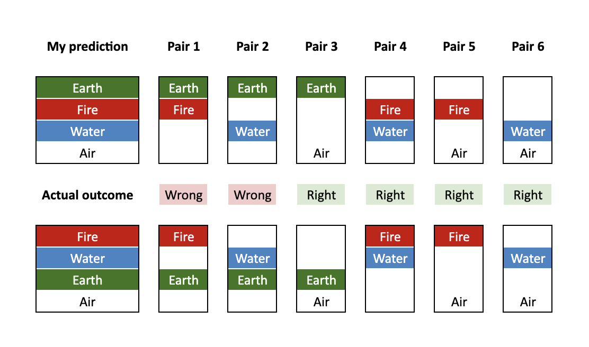
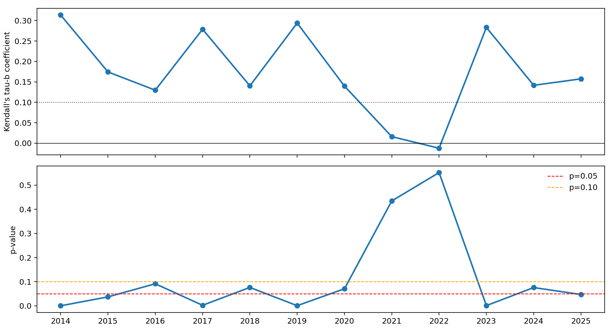
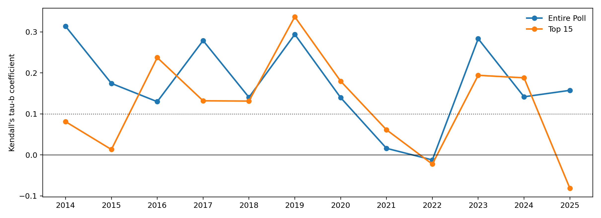
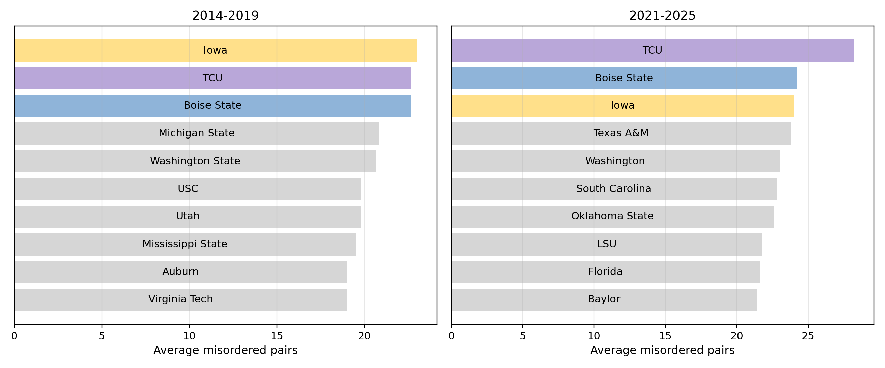

Determining whether college football is fundamentally broken is beyond the scope of this article. Hundreds of articles, opinion pieces, and mailbags – not to mention an [executive order](https://www.whitehouse.gov/presidential-actions/2026/04/urgent-national-action-to-save-college-sports/) – have already been dedicated to “fixing” college athletics, and I will not be adding to the pile.

Instead, my question is this: how has the transfer portal affected our ability to forecast the season? We’ll focus on an annual exercise that is [ridiculed at times](https://sportsanalytics.studentorg.berkeley.edu/articles/ap-poll-hype-train.html), but ultimately inescapable: the preseason AP poll. You can imagine two schools of thought:

* The portal makes it harder: Preseason rankings used to rely on relative roster continuity. Now that players can move at will, they’re just darts thrown at a moving target.
* The portal makes it easier: The direction of the talent flow is systematic – elite players leave poorer programs for wealthier ones – meaning the same handful of teams will inevitably occupy the top of the table, and we just have to guess the order.

(A brief primer for my international audience: Until 2021, the governing body of U.S. college sports mandated that players were amateurs. They were prohibited from receiving salaries or endorsement deals and generally restricted from switching universities. [This fell apart](https://en.wikipedia.org/wiki/National_Collegiate_Athletic_Association_v._Alston) once the volume of lawyers yelling “antitrust violation” in various courtrooms became too loud to ignore. Players can now move between schools at will and sign “Name, Image, and Likeness” (NIL) advertising deals – a sanctioned channel for them to receive millions of dollars, while technically still not being university employees. If this sounds confusing, just be thankful you aren’t one of the [several judges](https://www.collegesportslitigationtracker.com/tracker) across the country still tasked with ironing out the details.)

The 2025 season provided an especially stark case study. As an alumnus and fan of the preseason #1 (Texas), I take little pleasure in discussing this topic, but at least we only fell to #12 in the final poll. The preseason #2 (Penn State), #4 (Clemson), #9 (LSU), #11 (Arizona State), #13 (South Carolina), and #15 (Florida) teams all fell out of the poll entirely, costing [several](https://www.espn.com/college-football/story/_/id/46573030/penn-state-fires-head-coach-james-franklin-sources-say) [coaches](https://www.espn.com/college-football/story/_/id/47049415/lsu-formally-moves-fire-brian-kelly-response-lawsuit) their [jobs](https://www.espn.com/college-football/story/_/id/46649076/florida-fires-coach-billy-napier-3-4-start-2025) in one of the most volatile early seasons on record. To cap it off, Indiana won the national title after starting at #20, the lowest preseason rank for an eventual champion since Cam Newton’s #22 Auburn in 2010. This has led plenty of people to declare that preseason rankings are officially broken – but what do the numbers say?

### The data

Our dataset consists of the preseason and final [AP polls](https://www.espn.com/college-football/rankings) for the last 12 years, starting with the 2014 season – the dawn of the College Football Playoff era. Before then, media polls had an actual job: they were part of the [BCS calculation](https://bcsknowhow.wordpress.com/bcs-formula/) used to determine which two teams were allowed to play for a national title. It was a harmonious system that [never](https://en.wikipedia.org/wiki/Bowl_Championship_Series_controversies) led to any disputes. 

Since 2014, the polls have been purely ceremonial. The real power moved to a committee of coaches, athletic directors, and Condoleezza Rice, who convene at the [Gaylord Texan](https://www.footballscoop.com/2025/11/04/inside-the-college-football-playoffs-selection-process) resort in Dallas every December to eat [disappointing Tex-Mex](https://www.tripadvisor.com/Restaurant_Review-g55930-d2425201-Reviews-Riverwalk_Cantina-Grapevine_Texas.html) and hand-pick a bracket. The field was limited to four teams until 2023, expanded to twelve for the last two seasons, and will probably reach twenty-four by the time you’re reading this. 

Even without an official role, the AP poll remains the sport's primary hierarchy, used by fans, journalists, and TV executives to track team trajectories and pick out the most exciting matchups. Every week, a panel of roughly 60 sportswriters and broadcasters submit a top 25. Points are assigned in inverse order (25 for first place, one for 25th) and the totals are aggregated. The preseason ranking is infamously hit-or-miss, maybe because no one has actually touched a ball yet, but it still represents the media’s collective “best guess” for how the season will unfold.

### The statistical approach

To measure how well the preseason AP poll anticipates the final rankings, we’ll use a statistical test for ranking correlation called [Kendall’s Tau](https://en.wikipedia.org/wiki/Kendall_rank_correlation_coefficient). This isn't concerned with win-loss records or bowl game results; it looks purely at how well you predicted the overall order of the field, based on the percentage of two-team pairings you got right.

For a simple example, suppose there are four parties running for mayor of Element City: 

* Fire (red): We want to watch the world burn!
* Water (blue): We’re completely lukewarm and flavorless. Please don’t be mad at us.
* Earth (green): We’re just happy to be here!
* Air (white): We could solve all your problems and usher in a new age of peace and prosperity, but no one has seen us for over a century.

As the graphic shows, predicting the overall order of these four parties is equivalent to guessing a set of six ordered pairs. In the final results, each of these six pairs is either right or wrong. To calculate the Tau, I take the correct pairs minus the incorrect pairs, and divide by the total. A perfect Tau is 1, a perfectly wrong Tau (where I get the order backwards) is -1, and a totally random guess should average out to zero. My Tau in the Element City election is (4-2)/6, or 0.33, indicating a moderately correct prediction even if we were [wrong about the winner](https://en.wikipedia.org/wiki/Nate_Silver).

For a list as volatile as the AP poll, this is a well-suited statistical method because it penalizes misses based on their relative impact. If the preseason #1 team collapses and drops out of the rankings entirely, it breaks significantly more pairings – and therefore gets a heavier penalty – than if the #15 team does the same thing. The math therefore ensures that being wrong (or right!) carries more weight at the top of the table than at the bottom, but also that a few bad misses won’t completely torpedo your score. More details on our precise implementation can be found in the appendix.

### The results

Our main baseline looks at the entire AP poll, including every team that received even a single stray vote in either the preseason or final rankings. After 2021, there was a noticeable dip where the Tau effectively fell to zero, suggesting the voters' predictive capacity had vanished. This period lasted for precisely two seasons. The most likely culprit wasn't even the transfer portal, but the administrative debris of a different disruptive event in 2020 (remember that?), which led to a patchwork of emergency redshirts and eligibility exemptions that scrambled roster data. Since 2023, the rankings have returned to their pre-NIL baseline, anticipating the final results with substantial accuracy. 

The p-values confirm this temporary loss of signal. Without getting too deep into a [philosophical debate](https://www.jstor.org/stable/3182859) about hypothesis testing, you can interpret the p-value as the probability that the voters would have been this accurate by pure chance. In 2021 and 2022, the p-values were poor, indicating the rankings were statistically indistinguishable from noise. For every other year in the sample, however, the results remained significant – often at the 0.05 level – confirming that the media’s guess still carries predictive power.

For a secondary analysis, we narrow the focus to the top 15 teams in either the preseason or final rankings – in other words, the approximate group of teams relevant to the current 12-team playoff conversation. The accuracy remains relatively consistent with the overall poll, though with three distinct intervals where the Tau falls below 0.1:

* 2014 and 2015: The dawn of the CFP era, when voters had to unlearn the old BCS formula and start calibrating to the whims of a new selection committee.
* 2021 and 2022: The transfer portal and pandemic scramble, as discussed above.
* 2025: A genuinely inexplicable statistical anomaly. The worst top-15 forecast in the entire sample, actually well into negative predictive territory, meaning you would have been better off taking the list and flipping it on its head.

### Sidebar: The most erratic teams of the CFP era

Since we’ve gone to the trouble of analyzing all this data, it would be a shame if we didn't also make fun of somebody. So let’s identify the most unpredictable teams since 2014. In other words, who has created the most statistical chaos with their movement up and down the polls? We’ll measure this by the average number of misordered pairs a team is involved in. For example: if you start at #9 and ultimately jump three teams that were ahead of you, but fall behind seven teams who were behind you, you’ve racked up ten misordered pairs for the year. 

To "excel" in this category, a team has to be consistently inconsistent. Alabama and UMass don’t cause many headaches; the voters always know where they belong. The true kings of confusion are the teams that evade the consensus in both directions, soaring out of the ashes one year, then promptly falling flat when expectations rise the next.

From 2014 to 2019, the most erratic teams were Iowa, TCU, and Boise State. This isn’t all that surprising. TCU and Boise State are the classic bracket-busters, repeatedly crashing the New Year’s bowls (and even the 2022 title game). Meanwhile, Iowa is Iowa. The Hawkeyes are a statistical black hole where [logic goes to die](https://www.espn.co.uk/college-football/story/_/id/35603611/iowa-amends-oc-brian-ferentz-deal-incentives-points-wins), the only program capable of winning ten games with the nation’s 133rd-ranked offense. My official opinion is that I have no idea what's going on there.

And when we look at the post-COVID/NIL era from 2021 to 2025? The entire top ten changes, except for the top three, where we find some familiar faces: TCU, Boise State, and Iowa. Stop for a moment to appreciate how weird this is. A global pandemic, the transfer portal, and NIL couldn’t shake their commitment to statistical anarchy. They are the Three Musketeers of Chaos, and the only real surprise is that the voters keep failing to learn. Even in the years when stability reigns for the rest of the country, these three teams insist on being the glitches in the matrix.

### What does it all mean?

The data suggests that NIL and the transfer portal haven’t fundamentally broken the sport's predictability. The preseason AP poll remains roughly as accurate (or as flawed) as it has ever been. We saw a brief two-year window where the pandemic scrambled rosters, and voters had to relearn that “portal rankings” now carry as much weight as traditional recruiting stars. By 2023, the dust had settled and experts had updated their methodology; today, preseason analysis is incomplete without an audit of a team's key [incoming and outgoing transfers](https://www.on3.com/transfer-portal/team-rankings/football/2026/). The poll is still perfectly capable of separating the sport’s haves from the have-nots.

You might argue that this isn’t "predictive power" so much as it is a reflection of the sport’s rigid pecking order. There is now a clearly defined, one-way conveyor belt of talent moving from the Group of 5 (6?) to the Power 4 – and even within that top tier, a secondary sift pulling the best players toward the SEC and Big Ten. My only response, having spent over two decades happily observing this particular brand of chaos, is that it has never been any other way. I can still hear the mid-2000s ESPN segments debating the “Big Six” conferences and the elite few who enjoyed automatic entry into the BCS bowls. The regulations change on paper, but the hierarchy remains stubborn on grass.

For the top 15, the story is the same. With the exception of the early CFP transition (2014–2015) and the 2021–2022 “blackout,” the poll has historically predicted the playoff-tier teams reasonably well. 

And that brings us back to last year. It is tempting to use Indiana’s title run and the collapse of the top five as evidence of a new era of total chaos. However, the stability of 2023 and 2024, along with the decent overall result for 2025 itself, suggest a different conclusion. My interpretation is that 2025 was a genuine statistical anomaly rather than a permanent regime shift. The crystal ball hasn’t necessarily shattered; it was just a historically bad year to be a preseason favorite. Will the [2026 results](https://www.si.com/fannation/college/cfb-hq/rankings/college-football-rankings-2026-ap-top-25-phil-steele-prediction) restore order? Is this entire analysis merely the elaborate wishful thinking of a deluded Longhorns fan? Only four more months of off-season to go!

### Appendix

Code and data are [available on Github](https://github.com/vshirvaikar/vshirvaikar.github.io/tree/main/blog). I'm always happy to discuss collaboration ideas; my contact information can be found under the CV tab.

The precise statistical test we apply is [Kendall’s Tau-b](https://docs.scipy.org/doc/scipy/reference/generated/scipy.stats.kendalltau.html), which is designed to handle "ties" – a necessity since a portion of the field eventually disappears from the rankings. If the preseason #2 and #4 both have losing seasons and receive zero final votes, we have no data to determine which of those two was “better” in the end. In this scenario, Tau-b treats them as tied at the bottom of the list. They are still penalized for falling behind every team that actually remained ranked, but they aren't counted as right or wrong for their relative order to each other. 

For the main analysis, we include every team that received at least one vote in either the preseason or the final poll, which typically results in a field of 50 to 60 teams. For the secondary analysis, we apply the same logic to teams that appeared in either the preseason or final Top 15, giving us a smaller sample of roughly 20 “playoff-tier” teams per year. 

The p-value comes from a one-sided hypothesis test where the null hypothesis is that there is zero correlation between the two polls. A p-value below 0.05 indicates there is less than a 5% chance the voters would have arrived at their rankings by accident. We don’t directly compare p-values across the two samples because the math is sensitive to the number of teams; it is statistically much easier to prove that a 60-team list isn't a fluke than a 20-team list.